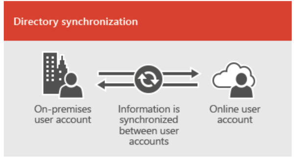
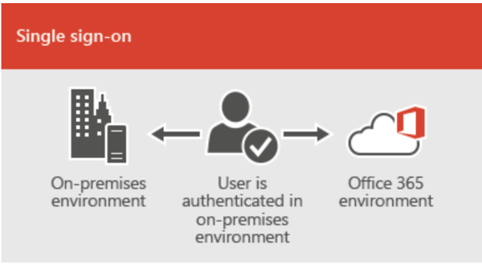

If you're considering migrating your email systems to Microsoft&reg; Office
365&reg;, there are a variety of migration methods. The best fit depends on
your requirements. This blog post covers factors you should consider when
choosing an email migration method.

<!--more-->

### Introduction

When you're deciding on a migration method, you should consider the following
factors:

- The number of objects to be migrated
- The amount of data to be migrated
- Your existing email system
- Your Exchange Servers version
- The duration of the migration project
- The costs involved

It's important to have these details nailed down before you start migrating
data. After you're clear on the basics, you can move on to choosing a migration
method.

### Migration methods

This section describes various email migration methods that you might want to
consider.

#### Cutover migration

A cutover migration migrates all existing mailboxes, contacts, and
distribution groups from an on-premises Microsoft Exchange system to Office
365.

This type of migration is performed as a single batch move that includes all
of your mailboxes, contacts, and distribution group objects. There's no option
to migrate objects selectively. After the migration is complete, every user
that has an on-premises Exchange mailbox also has an Office 365 account.

**When to choose a cutover migration**

You might want to choose a cutover migration when the following conditions are
met:

- The current on-premises Exchange environment is Exchange 2003, 2007, 2010, or
  2013.
- The current on-premises Exchange environment has less than 2,000 mailboxes.

**Note:** According to Microsoft, "Even though cutover migration supports
moving up to 2000 mailboxes, due to the length of time it takes to create and
migrate 2000 users, it is more reasonable to migrate 150 users or less."
Source: [What you need to know about a cutover email migration to Office
365](https://support.office.com/en-us/article/what-you-need-to-know-about-a-cutover-email-migration-to-office-365-961978ef-f434-472d-a811-1801733869da)

**Impact**

The main logistical challenge with cutover migration is the need to
reconfigure every user's Outlook profile to connect to Office 365.

#### Staged migration

A staged migration migrates all existing users and resource mailboxes from
on-premises Exchange 2003 and Exchange 2007 organizations to Exchange Online.

This migration method moves mailboxes to Office 365 over a period of time.
When the process is complete, all mailboxes are hosted in Office 365. This
option is suitable for medium-sized organizations.

**When to choose a staged migration**

You might want to choose a staged migration when the following condition is
met:

- The source email system is Microsoft Exchange 2003 or 2007.

**Note**: Staged migration isn't available for organizations with Microsoft
Exchange 2010 or 2013. Use cutover or hybrid migration for these versions.

The key requirement for staged migration is the Directory Synchronization
tool. This tool replicates user accounts from your on-premises Active
Directory database and adds them to the Office 365 organization.

With a staged migration, mailboxes are moved in batches over a period of time
so that there's a simple, high level of coexistence during the migration.
Users who have mailboxes in Office 365 can send and receive emails from
on-premises users, and vice-versa. They can see each other in the Global
Address List (GAL), but they can't share calendar availability information or
access delegates.

#### Hybrid migration

With a hybrid deployment, you can integrate Office 365 with your on-premises
Exchange servers, and also with the existing directory services. This
functionality facilitates the synchronization and management of user accounts
for both environments.

**Hybrid deployments provide rich features**

A hybrid configuration wizard establishes federation and connectors between
an on-premises Exchange environment and an Office 365 tenant.

With hybrid deployments, mailboxes can be natively moved in and out of
Exchange Online. It's also possible to keep some mailboxes on-premises and
some on Office 365.

You can also add password synchronization or single sign-on (SSO) so that
users can log on to both the environments with their on-premises credentials.

**When to choose hybrid deployments**

You might want to choose a hybrid migration when the following condition is
met:

- The source email system is Exchange 2010 or later.

**Note:** If your on-premises Exchange organization is running Exchange 2007
or 2003 and you want to connect your organization to Office 365, you must
install at least one on-premises Exchange 2013 or Exchange 2010 Service Pack 3
(SP3) server. This server is used for hybrid deployment connectivity, which
seamlessly connects your on-premises Exchange and Exchange Online
organizations.

To avoid the additional cost of an Exchange 2013 or Exchange 2010 SP3 server
license, check to see if you qualify for a free Hybrid Edition product key for
Exchange 2013 or Exchange 2010 SP3.

#### IMAP migration

Staged, cutover, and hybrid migrations use Outlook Anywhere or Exchange Web
Services (EWS) to connect to Office 365. However, customers who aren't using
Microsoft Exchange servers aren't able to use Outlook Anywhere or EWS.

If you're one of them, you can use a different migration method, such as
Internet Message Access Protocol (IMAP). IMAP extracts information from your
source mailboxes and then pushes it to Office 365.

However, IMAP migrations are limited. For example, while the process migrates
mail items, it doesn’t migrate calendar, contacts, notes, or other item types.
There's also a limit of 5,000,000 items and 50,000 total mailboxes.

### Understanding Office 365 identity models

There are three main identity models in Office 365 for setting up and
managing user accounts.

#### Identity

The Identity model manages Rackspace user accounts in Office 365 only. Because
user management takes place entirely in the cloud, no on-premises servers are
required to manage users. The cutover migration process provisions the user
objects as cloud identities automatically. However, organizations can opt to
use Directory Synchronization after the migration process is complete.

#### Synchronized Identity

The Synchronize Identity model synchronizes on-premises directory objects with
Office 365 and manages users on-premises. You can also synchronize passwords so
that users have the same password on-premises and in the cloud. However, users
need to sign in again to use Office 365.

Image source: [Office 365 integration with on-premises
environments](https://support.office.com/en-us/article/Office-365-integration-with-on-premises-environments-263faf8d-aa21-428b-aed3-2021837a4b65?ui=en-US&rs=en-US&ad=US)

#### Federated Identity

The Federated Identity model synchronizes on-premises directory objects with
Office 365 and manages users on-premises. Users have the same password
on-premises and in the cloud, and they do not have to sign in again to use
Office 365. This model is often referred to as single sign-on.

Image source: [Office 365 integration with on-premises
environments](https://support.office.com/en-us/article/Office-365-integration-with-on-premises-environments-263faf8d-aa21-428b-aed3-2021837a4b65?ui=en-US&rs=en-US&ad=US)

### Conclusion

The following takeaways will help you decide on the best email migration type
for your company:

- Cutover migration is similar to a single batch move and suitable for small
  organizations.
- Staged migration moves mailboxes in batches and is suitable for medium-sized
  organizations.
- Hybrid migration is a feature-rich migration that enables you to natively
  move mailboxes.

Each migration method has advantages and disadvantages. Bear in mind that you
can minimize any negative impacts by conducting a pre-assessment of the source
email environment and choosing the ideal migration type for your needs.

Use the Feedback tab to make any comments or ask questions.
