Businesses today are becoming more multi-cloud than ever. When it comes to
Sitecore deployments, being able to have fast page response times in China is
becoming more critical. My goal is to create a secure site-to-site vpn tunnel
between Azure and Alibaba. Once the tunnel is setup, I can then test out remote
publishing target deployments.

<!--more-->

Starting off on the Azure side, you need to create a vnet with a non-overlapping
address range to what our other cloud provider network will be using.

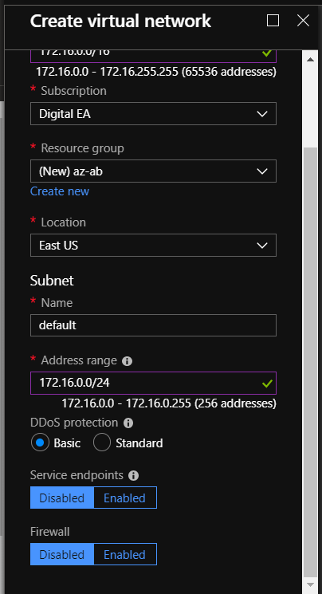

Once the vnet has been created, you create a new **Gateway Subnet**. Now that
a Gateway Subnet has been defined, create a **Virtual Network Gateway** in Azure.
Make sure to select `route-based` as the **VPN type**.

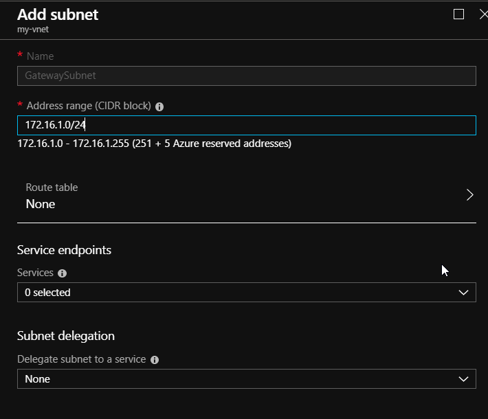

While the Azure VPN Gateway is provisioning, log into the Alibaba Cloud dashboard.
At this point, you want to mimic the steps from Azure but within Alibaba Cloud.
Create a **VPC** and a **Vswitch**, and do not overlap the IP address range used
in Azure.

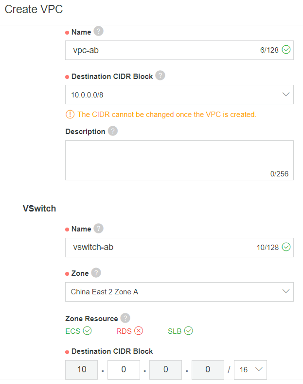

Next, create a **VPN Gateway** and select the VPC that you previously created.

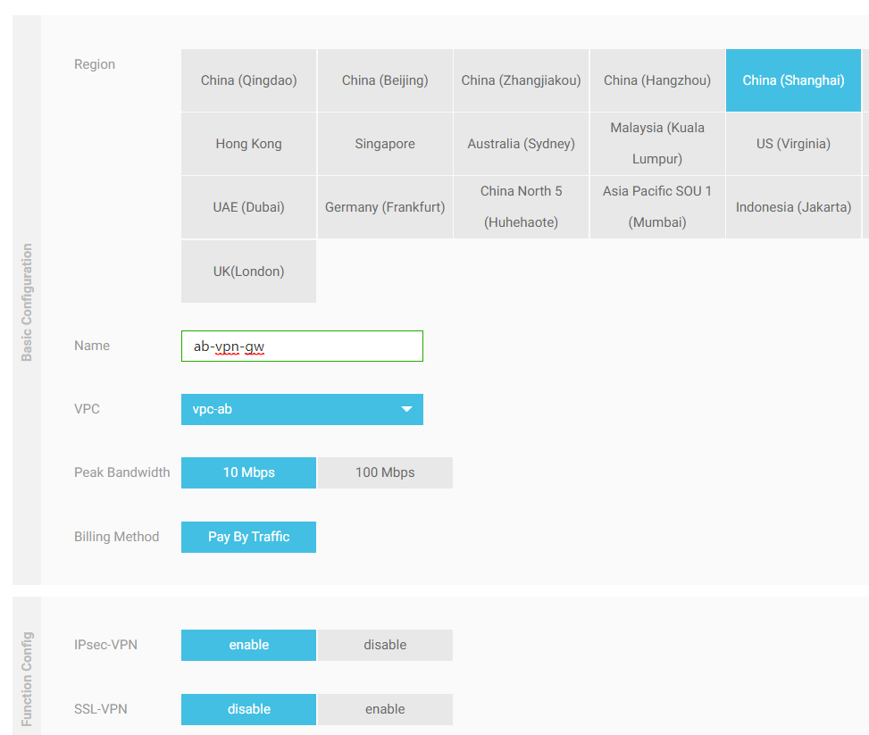

Within the Azure portal, create a Local Network Gateway. Take the public IP
address from the Alibaba VPN Gateway and type it into the **IP address** text
box in Azure. Specify the Alibaba VPC CIDR address space in the **Address space**
text box. Click **Create** to provision the resource

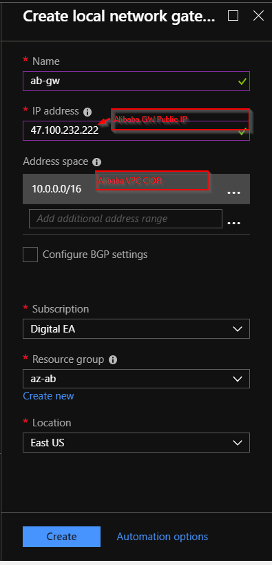

Within the Alibaba portal, create a **Customer Gateway**. This is similar to a
*Local Network Gateway* in Azure. Type in the public IP address from Azure's VPN
Gateway into the **IP Address** text box.

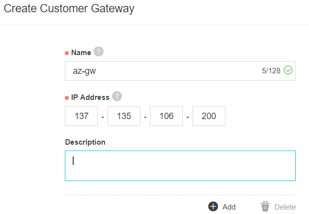

The next step is to configure the connections to both gateways. In Alibaba,
select **Create an IPSec Connection** and choose the VPC and VPN Gateway. Type
in the IP CIDR of your Alibaba local network in **Local Network** and then type
in the IP CIDR of your Azure Network in **Remote Network**. Select `Yes` for
**Effective Immediately** choice.

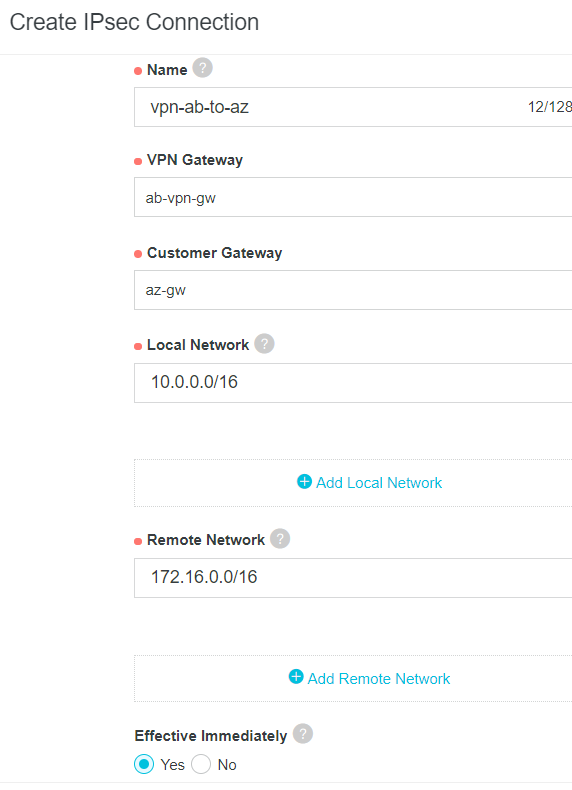

Enable the **Advanced Configuration** option to list the Ike configurations.
Generate a 16 bit, pre-shared key and type it into the **Pre-Shared Key** text
box. Make the following selections:

- `Ikev2` for **Version**
- `aes256` for **Encryption Algorithm**
- `28800` for **SA Life Cycle (Seconds)**.

Under the **IPsec Connections** label, select `aes256` and `28800` for **SA Life Cycle (Seconds)**.

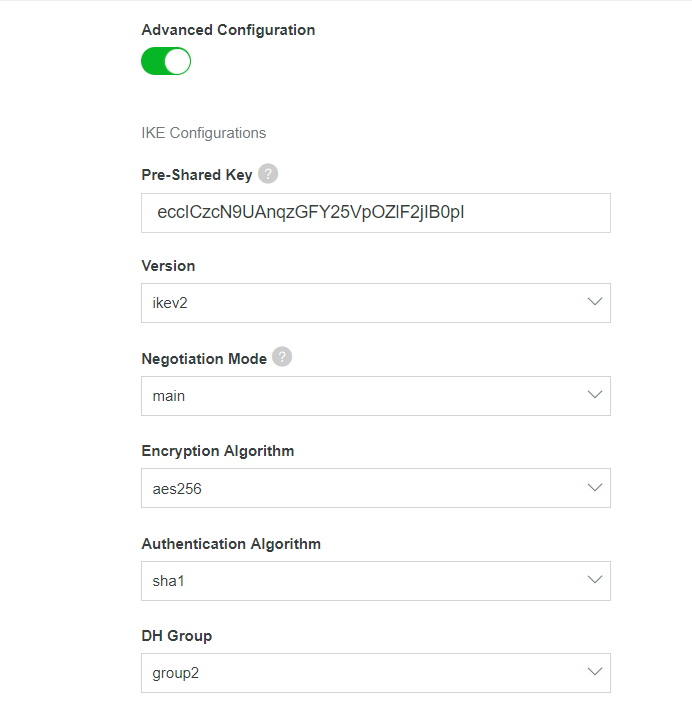
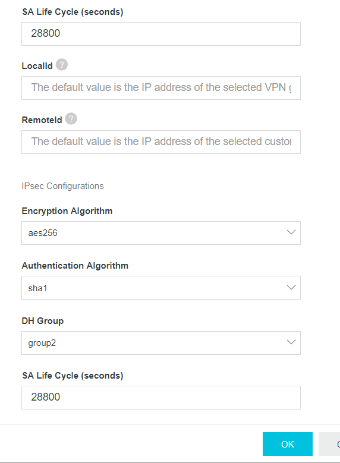

In the Azure Portal, navigate to your **Local Network gateway** connection object.
 Select **Connections** from the blade and then select **Add**. Give your
 connection a **name**, select your **VPN Gateway**, and type in your pre-shared
 key that you used in Alibaba IKE Configuration.

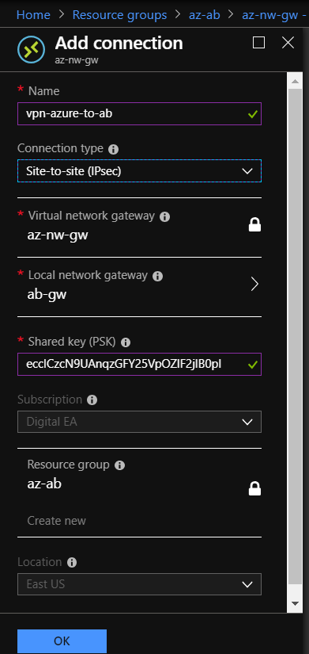

The final step is to add a route entry into your Alibaba VPC Route Table. Within
your VPC, edit the route table and add a new entry. Type in the remote network
CIDR block, set the **Next Hop Type** to `VPN Gateway`, and select your VPN
Gateway.

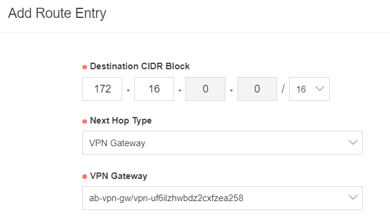

At this point, you have a route-based site-to-site VPN configured between Azure
and Alibaba Cloud. I stood up a SQL Server and front-end Sitecore content-delivery
node. Then I configured a remote publishing target. Benchmarking from US to China
for a remote publish was not favorable due to random timeouts. Looking at the
Sitecore publishing service, I deployed an Azure webapp and configured publishing
for that route. Publishing was instantly faster and had no timeouts.

Use the Feedback tab to make any comments or ask questions.
