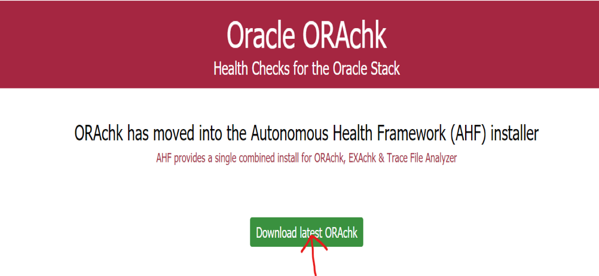
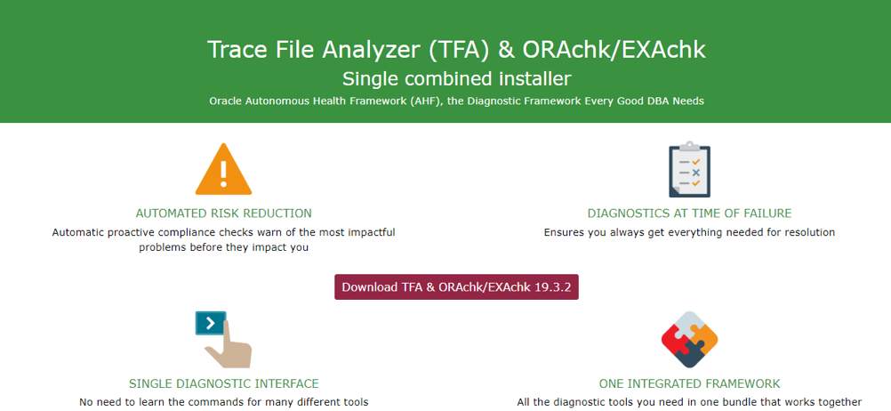
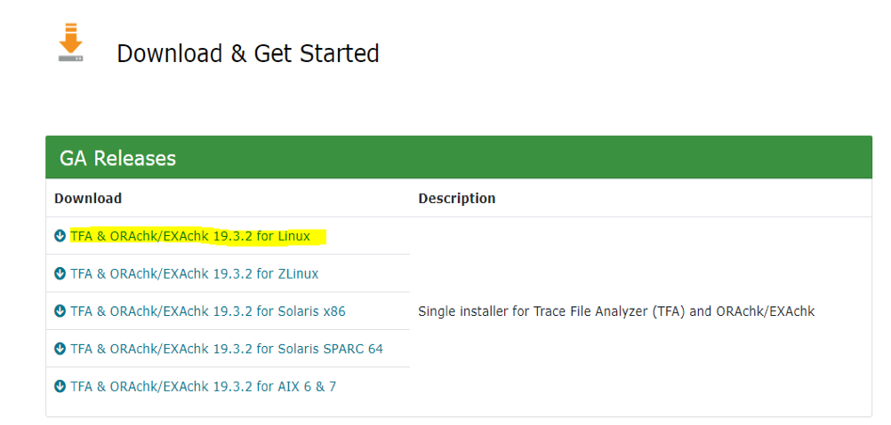

This blog post introduces Oracle&reg; ORAchk and shows you how to download,
install, and use this database audit tool.

<!--more-->

### Introduction

The Oracle&reg; Autonomous Health Framework (AHF) includes ORAchk, which
enables you to audit and validate your Oracle Database Appliance (ODA)
environment. You can use AHF without incurring extra fees.

ORAchk includes audit checks for known ODA issues, including the following
areas that might have problems:

- Oracle Database
- Grid infrastructure and Real Application Clusters (RAC)
- Upgrade readiness validation
- Maximum Availability Architecture (MAA) validation

The Oracle development and support team continuously improves ORAchk by adding
checks for the latest issues reported by users, and ORAchk proactively scans
your system for the problems.  These improvements offer you more significant
insights into the health of your ODA system, providing a better upgrade patch
application experience.

### Download ORAchk

Use the following steps to download ORAchk:

1) Click **Download latest ORAchk** from the **My Oracle Support** section of
   [AHF - Including TFA and ORAchk (Doc ID 2550798.1](https://support.oracle.com/epmos/faces/DocContentDisplay?_afrLoop=314622412757815&parent=ORAchk&sourceId=download&id=2550798.1&_afrWindowMode=0&_adf.ctrl-state=hg9do8tvw_4#quickstart)
   as shown in the following image:

  

2) Click **Download TFA & ORAchk**  as shown in the following image:

   

   The following download option displays:

   

3) Select a download version. We recommend that you download the Linux&reg; version,
   *TFA & ORAchk/EXAchk for Linux*.

### Install ORAchk

Use the following steps to install ORAchk:

1. Download and unzip **TFA & ORAchk/EXAchk 19.3.x.zip** into a temporary
   location.

2. Unzip the archive file and execute **ahf_setup** to install ORAchk on the
   ODA node.

If you have more than one ODA node, repeat these steps for each node that you
want to patch.

### Run ORAchk

We recommend that you run ORAchk from the Linux command line as the **root**
user as shown in the following example:

    [root@host1 orachk]# ./orachk

    Clusterware stack is running from /u01/app/18.0.0.0/grid.
    Is this the correct Clusterware Home?[y/n][y]

    Confirm the Clusterware_HOME, By default it is [y]

**Note**: If you run ORAchk in the terminal from a device on the network, you
might encounter network issues. However, if you run the tool by using Virtual
Network Computing (VNC), ORAchk continues to run even during network
interruptions. If ORAchk fails to run, rerun it.  It starts again from the
beginning and does not resume from the point of failure.

### Conclusion

Because Oracle is continually updating ORAchk, you should always make sure you
run the latest release of ORAchk before patching your system. By staying
updated, you can be confident that you can successfully apply the patches and
that you have addressed all known issues.

Use the Feedback tab to make any comments or ask questions. You can also
[chat now](https://www.rackspace.com/#chat) to start the conversation.

<a class="cta teal" id="cta" href="https://www.rackspace.com/dba-services">Learn more about our Database services</a>
