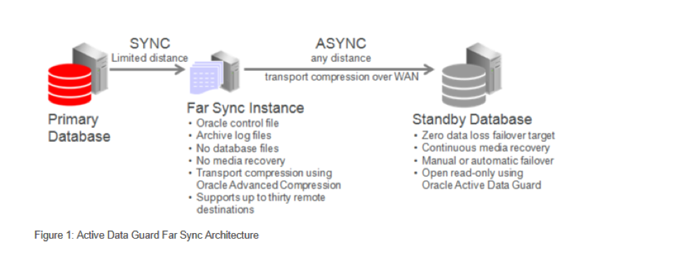

In this blog, I discuss an Oracle&reg; for Data Guard feature, Far Sync.

<!--more-->

Oracle designed this new configuration to support synchronous redo transport
between the primary and standby database, which are physically far apart. This
technique in Oracle 12c ensures zero data loss and protection for primary
databases located at any distance.

The feature accepts a redo from a primary database and ships the redo to the standby.
Because the Far Sync instance doesn’t contain datafiles, you cannot open it as a
primary or a standby in the future.

The Far Sync instance minimizes impact on commit response time, reducing that
time to an acceptable threshold value with higher data protection.

### Architecture

The following image shows a sample of Far Sync architecture:

*Image Source*: [https://www.oracle.com/technetwork/database/availability/farsync-2267608.pdf](https://www.oracle.com/technetwork/database/availability/farsync-2267608.pdf)

### Configuration

To configure Far Sync, perform the following steps.

#### 1. Create a Far Sync control file from a primary and copy it to the Far Sync server

Run the following code:

    ALTER DATABASE CREATE FAR SYNC INSTANCE CONTROLFILE AS ‘/home/oracle/farsync.ctl';

#### 2. Mount the Far Sync instance with the Far Sync control file you created

Select the Far Sync role by running the following code:

    SQL> select database_role from v$database;
    DATABASE_ROLE
    —————-
    FAR SYNC

#### 3. Set parameters for the primary database

On the primary database, add the following parameters to the init file:

    LOG_ARCHIVE_CONFIG='DG_CONFIG=(oraprimary,orafarsync,orastandby)' scope=both;
    LOG_ARCHIVE_DEST_2='SERVICE=farsync SYNC AFFIRM VALID_FOR=(ONLINE_LOGFILES,PRIMARY_ROLE) DB_UNIQUE_NAME=orafarsync'
    LOG_ARCHIVE_DEST_1='LOCATION=USE_DB_RECOVERY_FILE_DEST VALID_FOR=(ALL_LOGFILES,ALL_ROLES) DB_UNIQUE_NAME=oraprimary'

#### 4. Set parameters for Far Sync

In the Far Sync instance, add the following parameters to the init file:

    LOG_ARCHIVE_CONFIG='DG_CONFIG=(primary,farsync,standby)'
    LOG_ARCHIVE_DEST_2='SERVICE=standby ASYNC VALID_FOR=( STANDBY_LOGFILES,STANDBY_ROLE) DB_UNIQUE_NAME=orastandby'
    LOG_ARCHIVE_DEST_1='LOCATION= USE_DB_RECOVERY_FILE_DEST VALID_FOR=(ALL_LOGFILES,ALL_ROLES) DB_UNIQUE_NAME=orafarsync'

#### 5. Set parameters for the standby database

On the standby database, add the following parameters to init file:

    LOG_ARCHIVE_CONFIG='DG_CONFIG=(primary,farsync,standby)'
    LOG_ARCHIVE_DEST_2='SERVICE=primary ASYNC VALID_FOR=(ONLINE_LOGFILES,PRIMARY_ROLE) DB_UNIQUE_NAME=oraprimary'
    LOG_ARCHIVE_DEST_1='LOCATION= USE_DB_RECOVERY_FILE_DEST VALID_FOR=(ALL_LOGFILES,ALL_ROLES) DB_UNIQUE_NAME=orastandby'

### Conclusion:

The Far Sync feature helps to configure a zero-data-loss long-distance standby
database for organizations. It also helps to overcome inhibitions and win the
confidence of enterprises that think zero data loss can't be real and worry
about database performance.

A Far Sync instance also offloads from the primary database the overhead of
resolving gaps in the archived logs received by the remote standby database.
The instance can conserve WAN bandwidth by performing redo transport compression
without impacting primary database performance (off-host compression).

Use the Feedback tab to make any comments or ask questions. You can also
[chat now](https://www.rackspace.com/#chat) to start the conversation.

<a class="cta red" id="cta" href="https://www.rackspace.com/dba-services">Learn more about Databases.</a>
