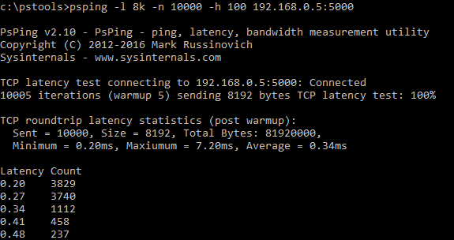
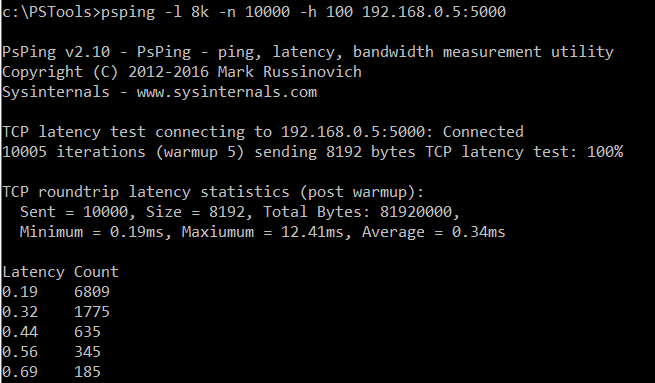

I hardly ever see the Azure&reg; proximity placement groups feature implemented for Infrastructure as a Service (IaaS) solutions. Do folks not know that this feature exists, or is it just one of the many components people forget when architecting? For those that do not know what a proximity placement group is, it is a logical grouping that tries to keep your virtual machines (VMs) physically close to each other to reduce network latency between those VMs.

<!--more-->

If you provision a VM but do not pick an availability zone, the provider could place that VM in any data center within the region you chose. Think about building out a N-tier architecture or a cluster. Those VMs could be spread across multiple data centers and unnecessarily increase latency for communication. As an easy and free fix, logically group your solution to one proximity placement group. 

### Benchmarking results from a SolrCloud cluster

I took a typical three-node D4s_v3 Apache&reg; SolrCloud cluster with accelerated networking enabled and provisioned it two times. In the first instance, I configured the availability set to tie it to a proximity placement group, and the other had no such setting. For my benchmarking tool of choice, I use [PsPing](https://docs.microsoft.com/en-us/sysinternals/downloads/psping). Microsoft&reg; also recommends [Latte](https://gallery.technet.microsoft.com/Latte-The-Windows-tool-for-ac33093b).

To set up a PsPing test, I choose one node with and without a proximity placement group as my server by specifying the `-s` switch with a source IP address and the port it binds with. Specifically, I used the following command: `psping -s 192.168.0.:5000`. On the node that had a proximity placement group tied to it and the node with no proximity placement group, I ran PsPing with the `-l` parameter to request a size of 8k and the `-n` parameter to set 10000 as the number of sends and receives. I also passed the `-h` parameter with 100 to set the bucket count for my histogram to print out.

Without a proximity placement group, the following image shows that the count column had a lowest latency of **.20** with a count of 3829, **.27** had 3740, and so forth. The lowest latency with the highest count is important. This shows our overall sends and the latency with which it correlates. We want a majority of the counts to be with the lowest latency.

With a proximity placement group, the lowest latency was **.19** and had a count of 6800. 

You can see the nodes with a proximity placement group had the lowest latency with a majority of packets. If you are not designing specifically for resiliency within a region, think about using a proximity placement group with your design patterns. For examples of adding a proximity placement group in your deployment, refer to the Microsoft [Azure Resource Manager (ARM) template example](https://azure.microsoft.com/en-us/blog/introducing-proximity-placement-groups/) or [PowerShell&reg; example](https://docs.microsoft.com/en-us/azure/virtual-machines/windows/proximity-placement-groups).
