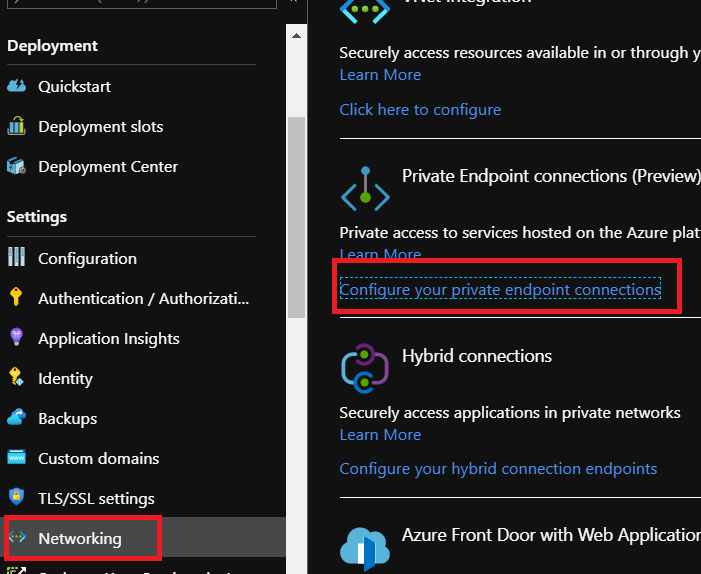
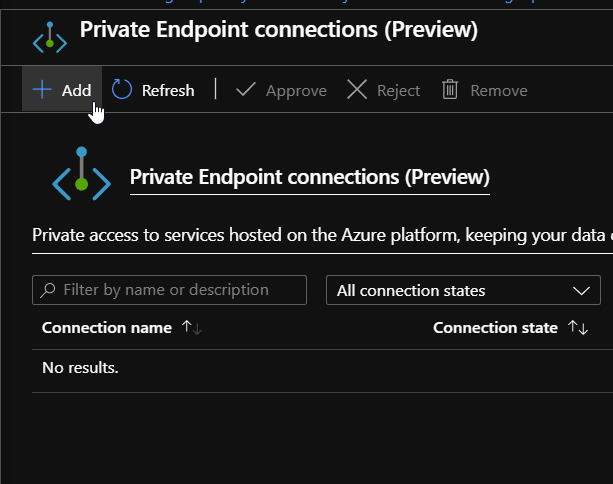
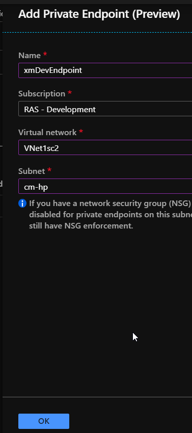
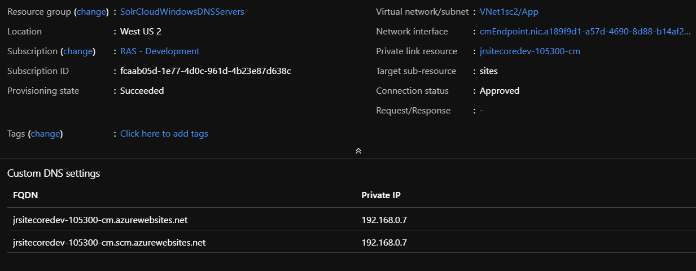
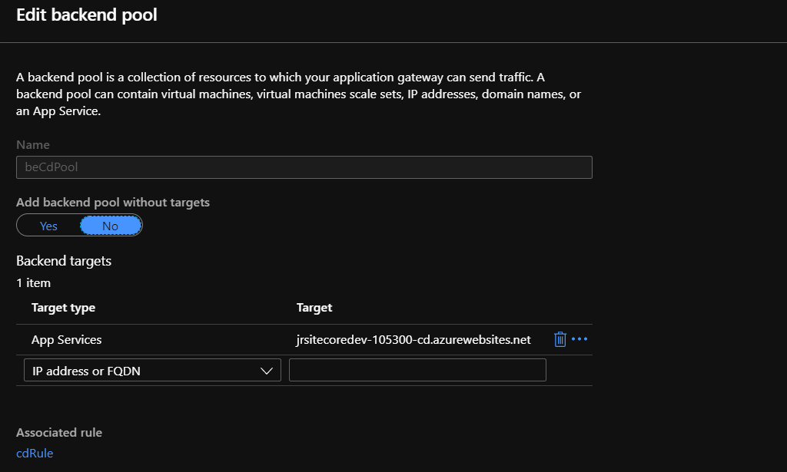
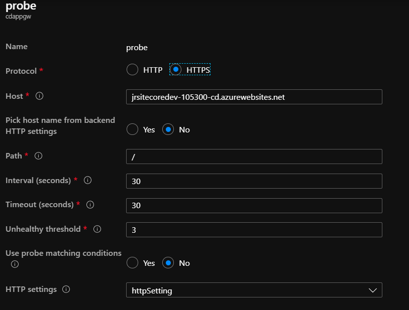
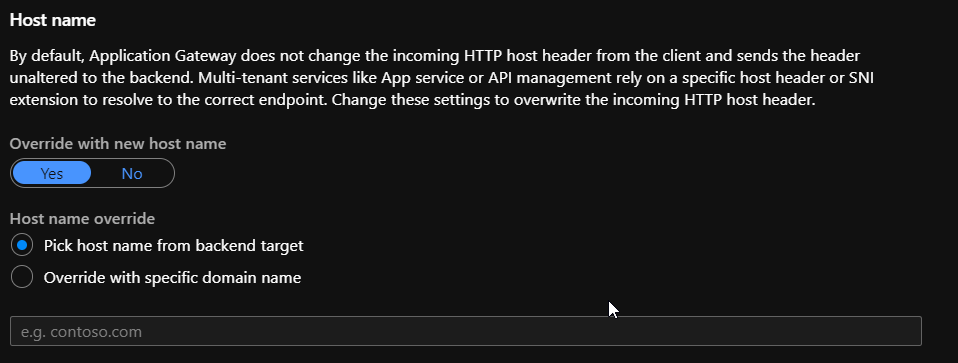

Azure&reg; Private Endpoint provides private IP address access by using a network interface controller
(NIC) attached to a virtual network subnet for an Azure web app, allowing access
from an on-premise VPN or ExpressRoute. Implementing an endpoint effectively blocks the public inbound access.
This technology is very similar to an internal App Service Environment (ASE) but much cheaper.

<!--more-->

You should know the following details about Azure Private Endpoint:

- It is only available in preview in two regions: EastUS and WestUS2.
- The App Service plan requires a PremiumV2 stock-keeping unit (SKU).
- You need a Domain Name System (DNS) server&mdash;either an Azure DNS zone or a virtual machine acting as a DNS server.

### My private endpoint test

For a real-world test, I provisioned a Sitecore&reg; 9.3 XM scaled development environment within Azure
PaaS. I deployed SolrCloud&reg; into a virtual network (VNet) with the correct subnets for regional VNet
integration and a VPN gateway to my on-premise location. VNet integration allows App Service web apps to
make outbound calls into a virtual network, but not inbound. While Azure has a neat Azure private
DNS offering, it does not work with VNet integration. You need a DNS server for name
resolution into the VNet. Not to jump ahead, but creating a private endpoint gives you the option to use
an Azure private DNS zone. I skipped it because I am already using a DNS server. Putting everything together,
a private endpoint allows private inbound into the web app, and VNet integration allows private outbound to
my virtual network. This setup sounds like a cheaper ASE.

With my Sitecore environment provisioned, I wanted only users within my on-premise corporate network to access
the Content Management (CM) web app. Out of the box, the CM web app has a public endpoint that anyone can access.
To meet my requirements, I need to provision a private endpoint for the web app. Follow these steps to create
an endpoint:

1. Make sure the App Service plan hosting the CM web app is using a PremiumV2 SKU.
2. Click on the CM web app, select **Networking** from the blade, and select **Configure your private endpoint connections**.

3. Click **Add** in the header to add a private endpoint.

4. Give the endpoint a name. Then, select the subscription, the VNet to provision to, and the subnet for the
   endpoint to consume. Note that the VNet integration also requires a subnet, so the private endpoint and the
   integration subnet cannot overlap.

After you provision the endpoint, the web app loses all inbound public connectivity because you associated a
private IP address with the fully qualified domain name (FQDN) and Kudu&reg; URL. 
    
(endpointIp.png)
    
If you are using the **azurewebsites.net** domain, you need to add a DNS zone to route traffic to the private
IP address associated with the web app. With Sitecore, this would effectively break the application because I
added only one web app with a private endpoint. Consider the CM login that talks to the Sitecore Identity (SI)
web app for authentication. If I had one zone for **azurewebsites.net**, I would also need to add private endpoints
to all my web apps and then add A records into that zone for communication. Gets pricey, making everything a
PremiumV2 SKU. It would also break any other web app that I wanted to browse to on the **azurewebsites.net**
domain. 

You can approach this problem in two ways. Use a custom domain name on the web app that matches a zone in your
DNS server or create a DNS zone with the **azurewebsites.net** FQDN of the web app. Because this is a test, I
opted to use the latter and just created an A record pointing to the private IP of the endpoint for that specific
web app. 

    
Just like an internal ASE, you need to take into account the Kudu software configuration management (SCM) URL.
As the preceding image shows, I have two zones per web app with an A record pointing to the private IP address
of the endpoint for each zone. 

### Public access to a web app behind a private endpoint test

Now that on-premise users can access the CM web app for secure content authoring, I wanted to figure out what I
need to do if I have a Content Delivery (CD) web app behind a private endpoint but needed public users to
access it. Previously, by using an internal ASE, I could provision an application gateway and plug a hole into the
VNet. I didn't see how this is any different, so I approached it by using the following steps:

1. Provision an application gateway.
2. For the backend pool, target the FQDN of the CD-role web app.

3. Configure the health probe to use the FQDN of the CD-role web app.

4. Override the backend pool host name by picking the hostname from the backend target.

5. Configure my public DNS for my custom domain CNAME to the application gateway public FrontendIP.
6. Finally, configure Secure Sockets Layer (SSL) offloading for my custom domain.

### Conclusion

You can easily create a secure routable solution from on-premise to an Azure web with a combination of private
endpoints and regional VNet integration. Instead of using an internal ASE, try testing out the preceding steps
to see if this solution meets your needs. Find more information at the
[private endpoint documentation](https://docs.microsoft.com/en-us/azure/private-link/create-private-endpoint-webapp-portal).
   
